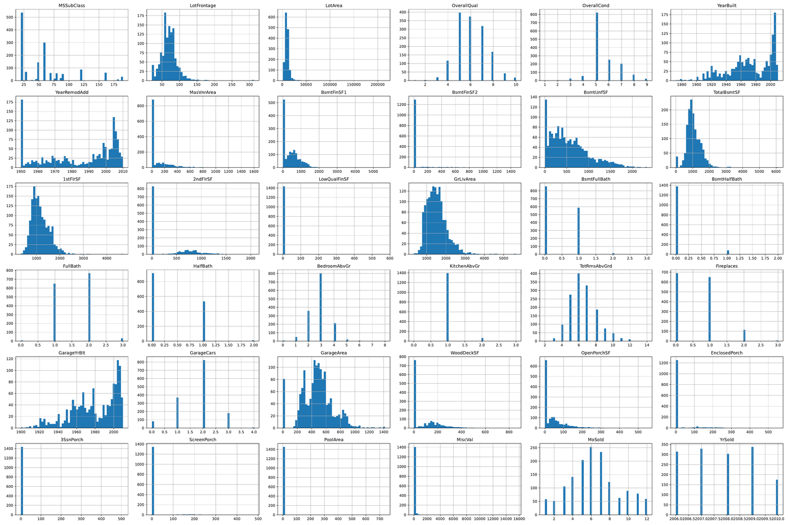
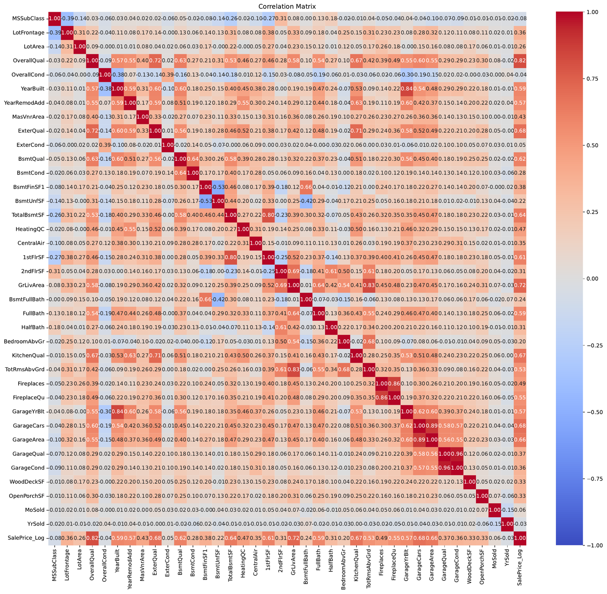
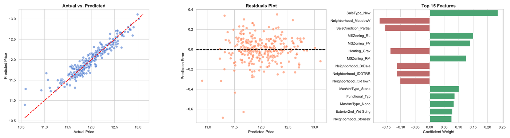
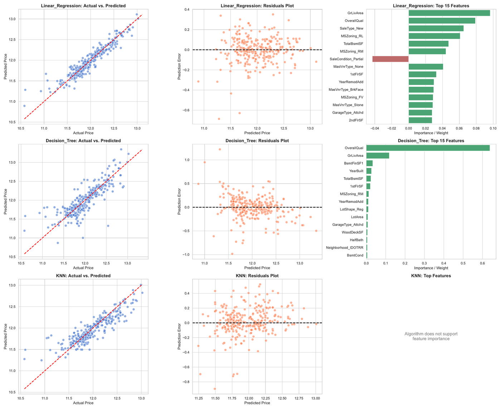
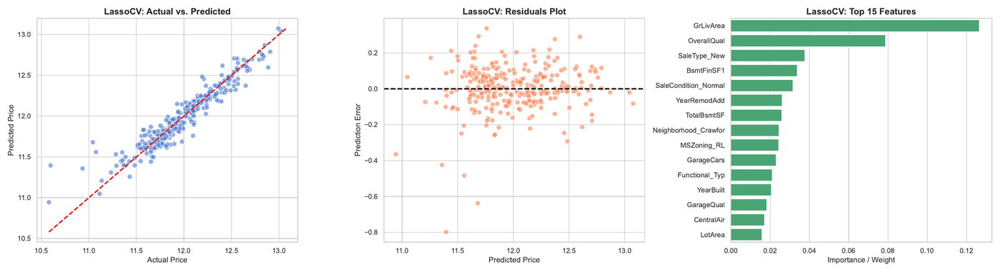

# House Prices Prediction - Ames Housing Dataset


## Project overview

This project focuses on predicting residential house prices using the **Ames Housing Dataset**.  
The main objective is to estimate `SalePrice` from structural, location-based and quality-related property features.

The project demonstrates a complete machine learning workflow:

- exploratory data analysis,
- missing value handling,
- outlier detection and removal,
- feature engineering,
- correlation analysis,
- dimensionality reduction with feature selection,
- regression model comparison,
- model interpretation using coefficients and feature importance.

The final result shows that strong preprocessing and feature engineering can make a simple linear model outperform more complex approaches.

## Dataset

The dataset used in this project is the **Ames Housing Dataset** from Kaggle:

> https://www.kaggle.com/datasets/shashanknecrothapa/ames-housing-dataset

It contains information about residential properties in Ames, Iowa, USA.  
The target variable is:

- `SalePrice` - final sale price of the property.

The dataset includes numerical, categorical and ordinal variables, for example:

- living area,
- lot area,
- year built,
- year remodeled,
- overall quality,
- basement features,
- garage features,
- neighborhood,
- sale type and sale condition.

## Repository structure

```text
.
├── README.md
├── notebooks/
│   └── house-prices.ipynb
├── assets/
│   ├── histograms.png
│   ├── correlation_matrix.png
│   ├── baseline_model.png
│   ├── pipeline_models.png
│   └── lasso_pipeline.png
└── reports/
    ├── histograms_house-prices.pdf
    ├── Ames_Correlation_Matrix.pdf
    ├── baseline-model.pdf
    ├── pipeline-models.pdf
    └── lasso-pipeline.pdf
```

## Exploratory data analysis

The numerical variables were visualized using histograms. This step helped identify skewed distributions, variables with many zero values and possible outliers.



Key observations:

- `SalePrice` is right-skewed, so the target was transformed using `log1p(SalePrice)`.
- Several variables contain many zero values, especially porch, pool and miscellaneous feature columns.
- `GrLivArea`, `LotArea`, `TotalBsmtSF` and `GarageArea` contain large values that required additional inspection.
- Four observations with `GrLivArea > 4000` were treated as anomalies and removed from the modeling dataset.

## Data preprocessing

The preprocessing phase included several important decisions:

### Missing values

Missing values were handled based on their meaning in the dataset:

- columns with extremely high missingness, such as `PoolQC`, `MiscFeature` and `Alley`, were removed;
- missing garage, basement, fireplace and fence-related values were interpreted as absence of that feature and replaced with `None`;
- `GarageYrBlt` was filled with `YearBuilt`;
- `MasVnrArea` was filled with `0`;
- `LotFrontage` was filled using the median value within each `Neighborhood`;
- the single missing value in `Electrical` was filled with the most frequent category.

After cleaning, the feature matrix contained no missing values.

### Target transformation

The target variable was transformed using:

```python
np.log1p(SalePrice)
```

This reduced target skewness and made the regression problem more stable.

### Encoding and feature engineering

The project used several feature engineering steps:

- ordinal quality variables were mapped to numerical scores;
- `CentralAir` was converted into a binary variable;
- categorical variables were encoded using one-hot encoding;
- low-signal variables were removed;
- strongly correlated duplicate-like variables were reduced;
- `SelectKBest` with `f_regression` was used to keep the most useful encoded categorical features.

This preprocessing created a cleaner feature space for regression models.

## Correlation analysis

A correlation matrix was created for numerical variables and the log-transformed target variable.



The strongest positive relationships with `SalePrice_Log` were observed for variables such as:

- `OverallQual`,
- `GrLivArea`,
- `GarageCars`,
- `TotalBsmtSF`,
- `YearBuilt`,
- `YearRemodAdd`,
- `KitchenQual`,
- `ExterQual`.

Variables with weak correlation to the target, such as `MoSold`, `YrSold`, `OverallCond`, `MSSubClass` and `ExterCond`, were treated as low-signal features.

## Models

The project compared several regression approaches:

### Linear Regression

Used as a baseline and then as a strong final candidate after feature engineering.

### Decision Tree Regressor

Used as a non-linear tree-based model.  
The diagnostic plots show a typical overfitting pattern: the model can adapt strongly to training data, but its prediction errors become less stable on unseen data.

### KNN Regressor

Used as a distance-based model.  
KNN was affected by high dimensionality after one-hot encoding. This is a practical example of the **curse of dimensionality**, where distance-based algorithms lose effectiveness when the feature space becomes large and sparse.

### LassoCV

Used as a regularized linear model.  
LassoCV applies L1 regularization and automatically selects the regularization strength using cross-validation. This makes it useful for both prediction and feature selection.

## Baseline model

The baseline Linear Regression model achieved strong performance after feature preparation:

| Model | Train R² | Test R² | Comment |
|---|---:|---:|---|
| Linear Regression baseline | 0.9206 | 0.8962 | Strong baseline with good generalization |



The baseline plots show:

- predicted values follow the actual values closely;
- residuals are centered around zero;
- coefficient weights reveal which features have the strongest positive and negative influence.

## Pipeline model comparison

The project also compared multiple modeling pipelines:

- Linear Regression,
- Decision Tree,
- KNN.



Interpretation:

- **Linear Regression** performed very well because the feature engineering process produced a clean, mostly linear feature space.
- **Decision Tree** showed a textbook overfitting tendency. It captured local patterns too aggressively and generalized worse.
- **KNN** suffered from the curse of dimensionality caused by the large number of encoded features.

## LassoCV results

LassoCV improved the linear modeling approach by adding L1 regularization.

| Model | Train R² | Test R² | Alpha | Comment |
|---|---:|---:|---:|---|
| LassoCV | 0.9272 | 0.9001 | 0.0016 | Best generalization and regularized feature selection |



The most influential LassoCV features included:

- `GrLivArea`,
- `OverallQual`,
- `SaleType_New`,
- `BsmtFinSF1`,
- `SaleCondition_Normal`,
- `YearRemodAdd`,
- `TotalBsmtSF`,
- `GarageCars`,
- `YearBuilt`,
- `LotArea`.

## Main conclusion

The main result of this project is that **the simplest model won because the data was prepared for it extremely well**.

At first glance, a Decision Tree may seem more powerful because it can model non-linear relationships. However, in this case it showed a classic overfitting pattern. It learned the training structure too closely and became less reliable on the test set.

KNN also struggled. After one-hot encoding and feature selection, the dataset still had many dimensions. For a distance-based algorithm, this is problematic because distances become less informative in high-dimensional spaces.

The strongest model family was linear regression:

- noise was removed,
- redundant correlated variables were reduced,
- rare and categorical variables were encoded,
- useful categorical features were selected with `SelectKBest`,
- the target was log-transformed,
- the final model used L1 regularization through LassoCV.

In practical terms, the feature engineering process created a clean linear path for Ordinary Least Squares and LassoCV.  
The final LassoCV pipeline crossed the **90% Test R²** threshold while keeping good resistance to overfitting.

## Final ranking

| Rank | Model | Summary |
|---:|---|---|
| 1 | LassoCV | Best generalization, L1 regularization, strong interpretability |
| 2 | Linear Regression | Very strong result thanks to feature engineering |
| 3 | KNN | Weaker in high-dimensional encoded space |
| 4 | Decision Tree | Overfitting-prone on this dataset |

## Technologies used

- Python 3
- Jupyter Notebook
- pandas
- NumPy
- matplotlib
- seaborn
- scikit-learn

## How to run

1. Clone the repository.
2. Install the required Python libraries.
3. Place the dataset file as `train.csv` in the notebook working directory.
4. Open and run:

```text
notebooks/house-prices.ipynb
```

Example installation:

```bash
pip install numpy pandas matplotlib seaborn scikit-learn jupyter
```

## Notes

This is a regression project. Therefore, the main model evaluation metric is R², not a confusion matrix.  
A confusion matrix would only be appropriate after converting continuous prices into discrete classes, such as low, medium and high price groups.

